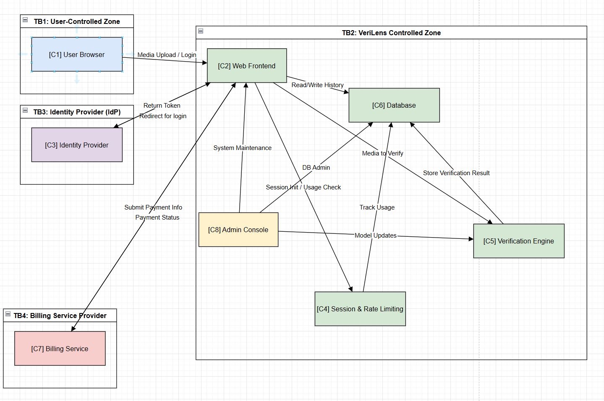

 # SWEN90010 Assignment 1  
## Task 1: System Architecture Diagram and Explanation  

###  Diagram

---

### Component List  

| ID   | Component Name            | Controlled By     | Description |
|------|---------------------------|-------------------|-------------|
| C1   | User Browser              | End User          | User interface used to access the web frontend, upload media, and receive results. |
| C2   | Web Frontend (UI + Logic) | VeriLens          | Handles user requests, session logic, result presentation, and communication with backend components. |
| C3   | Identity Provider  | Third-Party (e.g., Google) | Authenticates users and returns identity tokens. |
| C4   | Session & Rate Limiting   | VeriLens          | Tracks user session validity and request quotas. |
| C5   | Verification Engine       | VeriLens          | Runs AI models to detect deepfakes and generate analysis results. |
| C6   | Database                  | VeriLens          | Stores user data, verification results, and usage history. |
| C7   | Billing Service           | Third-Party (e.g., Stripe) | Handles financial transactions and stores payment credentials. |
| C8   | Admin Console             | VeriLens          | Internal system used by administrators to perform system updates and maintenance. |

---

###  Trust Boundaries  

| Boundary ID | Name                            | Controlled By     | Includes Components     |
|-------------|----------------------------------|-------------------|--------------------------|
| TB1         | User-Controlled Zone             | End User          | C1                       |
| TB2         | VeriLens-Controlled Zone         | VeriLens          | C2, C4, C5, C6, C8       |
| TB3         | Third-Party Identity Provider    | Google / Okta     | C3                       |
| TB4         | Third-Party Billing Provider     | Stripe / Others   | C7                       |

---

###  Communication Channels and Sensitive Data  

| From | To | Description | Sensitive Data Transferred |
|------|----|-------------|-----------------------------|
| C1   | C2 | User uploads media or initiates login |  User media, login credentials |
| C2   | C3 | Redirects user to external IdP        |  No sensitive data |
| C3   | C2 | Returns authentication token          |  Auth token |
| C2   | C4 | Session creation and quota checking   |  Session token, usage count |
| C2   | C5 | Sends media for AI verification       |  Media content |
| C5   | C6 | Stores verification results           |  Result + user ID |
| C2   | C6 | Loads history and user data           |  Account info, usage history |
| C4   | C6 | Records usage tracking                |  Usage logs |
| C2   | C7 | Forwards payment details              |  Credit card (transit only) |
| C7   | C2 | Returns transaction result            |  Billing status |
| C8   | C2/C5/C6 | Maintenance, model updates      |  High-privilege configuration |

---

###  Diagram Explanation  

> The architecture diagram above illustrates the core components and trust boundaries of the VeriLens system. The system is composed of eight major components, grouped into four trust boundaries based on control authority.
>
> - **TB1 (User-Controlled Zone)** contains the user's browser (**C1**), through which users interact with the system by uploading media, managing their account, or accessing verification results. 
>
> - **TB2 (VeriLens-Controlled Zone)** includes the main infrastructure operated by the VeriLens team: the web frontend (**C2**), session and rate limiting module (**C4**), AI-based verification engine (**C5**), central database (**C6**), and internal admin console (**C8**). These components cooperate to manage the core workflow: user request handling, identity/session management, media verification, result storage, and system maintenance.
>
> - **TB3 (Identity Provider)** contains the third-party identity provider (**C3**, e.g., Google or Okta) used for authentication. During login, users are redirected to the IdP, which verifies credentials and returns an authentication token to the web frontend. This inbound token transmission represents a critical trust interface and is explicitly marked in the diagram.
>
> - **TB4 (Billing Service Provider)** includes the external billing platform (**C7**, e.g., Stripe), which handles all payment-related operations. The web frontend collects billing details (e.g., credit card info) from the user and securely transmits them to the billing provider. VeriLens does not store any financial data locally. Periodically, usage metrics are sent from the VeriLens system to the billing service to trigger charges.
>
> Arrows in the diagram indicate legitimate communication channels between components, with labels showing the type of sensitive data transmitted. These include user-provided media, authentication tokens, usage records, verification results, and billing data. Each communication crossing a trust boundary is a potential security concern and will be analyzed in detail in Task 2 using the STRIDE framework.
---

## TASK 2
### STRIDE: Spoofing (Identity Forgery) + Real-World Examples

---

###  Threat 1: Token Reuse via Phishing

**(a) Potential Attacker**:  
External attacker (e.g., phishing operator, malware distributor)

**(b) Violated Security Goals**:  
Authentication, Integrity

**(c) How Might the Attack Be Carried Out**:  
The attacker creates a fake identity provider (IdP) login page (e.g., mimicking Google login), tricks users into logging in, and captures the authentication token. The attacker then sends this token to the VeriLens Web Frontend (C2) to impersonate the victim.  
**Assumption**: VeriLens uses OAuth 2.0 bearer tokens directly, without additional device binding or secondary verification, as is common in many real-world implementations.

**(d) Affected Components and Trust Boundaries**:  
- Component: C2 – Web Frontend  
- Trust Boundaries: TB3 (IdP → C2), TB1 → TB2

**Real-World Example**:  
This type of attack has been observed in real-world incidents. In 2019, Amnesty International documented a wave of OAuth phishing attacks targeting Egyptian human rights activists. The attackers tricked users into authorizing malicious third-party applications, thereby granting full access to their Gmail accounts without ever stealing their passwords. This illustrates how OAuth-based systems can be compromised without directly violating login forms.
(https://www.amnesty.org/en/latest/research/2019/03/phishing-attacks-using-third-party-applications-against-egyptian-civil-society-organizations/)

---

###  Threat 2: Malicious Insider Reusing Admin Credentials

**(a) Potential Attacker**:  
Former employee or internal user who retains valid admin tokens or credentials

**(b) Violated Security Goals**:  
Authorization, Accountability

**(c) How Might the Attack Be Carried Out**:  
The attacker reuses a previously valid token or gains access to an admin credential to connect to the Admin Console (C8). They perform unauthorized maintenance actions or access sensitive data.  
**Assumption**: Admin authentication relies on long-lived tokens or weak credentials without device verification or strong multi-factor authentication.

**(d) Affected Components and Trust Boundaries**:  
- Component: C8 – Admin Console  
- Trust Boundary: TB2 (Internal VeriLens-Controlled Zone)

**Real-World Example**:  
This scenario has occurred in the real world. In 2019, the U.S. Department of Justice charged two former Twitter employees, including Ahmad Abouammo, with acting as illegal agents of the Saudi government. They accessed private data of over 6,000 users—including email addresses, IPs, and login records—without authorization, to help Saudi authorities unmask and detain anonymous dissidents. Abouammo was convicted in 2022 and sentenced to 3.5 years in prison.
(https://en.wikipedia.org/wiki/Saudi_infiltration_of_Twitter)

---

###  Threat 3: Fake Web Frontend for Phishing

**(a) Potential Attacker**:  
External attacker hosting a phishing website

**(b) Violated Security Goals**:  
Authentication, Confidentiality

**(c) How Might the Attack Be Carried Out**:  
The attacker clones the VeriLens Web UI (C2) and hosts it at a lookalike domain (e.g., `verilens-check.com`). Users are tricked into submitting their login credentials or uploading media, allowing the attacker to steal personal data or deepfake content.  
**Assumption**: Users trust visual UI over validating TLS certificates or checking domain names.

**(d) Affected Components and Trust Boundaries**:  
- Component: C1 (user browser) interacting with a fake version of C2  
- Trust Boundary: Bypasses TB1 → TB2 trust assumptions

**Real-World Example**:  
In October 2020, attackers launched a phishing campaign targeting Office 365 users by mimicking Microsoft Teams notifications. Users were lured into clicking fake links that redirected to a forged Microsoft login page. Once credentials were entered, they were captured and used to compromise accounts. This demonstrates how phishing websites can closely replicate legitimate UIs to deceive users, a method that could similarly be used to spoof VeriLens's web frontend.
(https://cirt.gy/article/microsoft-teams-phishing-attack-targets-office-365-users-(22nd-october-2020)/)

---
###  Threat 4: Manipulated Media Files to Mislead Verification Results

**(a) Potential Attacker**:  
External attacker or advanced user

**(b) Violated Security Goals**:  
Integrity, Confidentiality

**(c) How Might the Attack Be Carried Out**:  
Before uploading media to VeriLens, the attacker embeds adversarial perturbations into the file. These subtle pixel-level changes are designed to confuse the AI model into misclassifying manipulated content as "authentic."  
**Assumption**: The verification engine (C5) has not been trained with adversarial examples and lacks robustness against such inputs—a known issue in many ML-based classifiers.

**(d) Affected Components and Trust Boundaries**:  
- Component: C5 – Verification Engine  
- Trust Boundary: TB1 (User Upload) → TB2

**Real-World Example**:  
In 2020, multiple research papers demonstrated that adversarial perturbations can successfully bypass ImageNet classifiers and deepfake detection models (e.g., Project PULSE), leading to incorrect outputs.

---

### Threat 5: Forged API Requests Overwriting Premium User Records

**(a) Potential Attacker**:  
Registered user (free or paid tier)

**(b) Violated Security Goals**:  
Integrity, Authorization

**(c) How Might the Attack Be Carried Out**:  
The attacker manually crafts HTTP requests, enumerates or forges other users' IDs, and submits forged data through the frontend API to modify someone else’s history or usage records—potentially to bypass billing.  
**Assumption**: The Web API (C2) does not enforce strict session-bound permission checks for each API call.

**(d) Affected Components and Trust Boundaries**:  
- Components: C2 – Web Frontend (API), C6 – Database  
- Trust Boundary: TB1 → TB2

**Real-World Example**:  
In 2012, GitHub experienced a permission bug that allowed attackers to submit pull requests to other users’ repositories and force-merge them without authorization.

---

###  Threat 6: Malicious Model Deployment via Compromised Admin Console

**(a) Potential Attacker**:  
Internal attacker or someone with access to a compromised admin account

**(b) Violated Security Goals**:  
Integrity, Availability

**(c) How Might the Attack Be Carried Out**:  
An attacker with access to the Admin Console (C8) uploads a tampered AI model that always returns high credibility scores or contains a backdoor. The change goes undetected due to a lack of deployment integrity checks.  
**Assumption**: Admin Console lacks code signing, audit logging, or an approval workflow for model updates.

**(d) Affected Components and Trust Boundaries**:  
- Components: C8 – Admin Console, C5 – Verification Engine  
- Trust Boundary: TB2 (internal privileged operations)

**Real-World Example**:  
In 2018, Tesla's internal cloud containers were exploited to deploy unauthorized cryptocurrency miners due to overly permissive deployment access.

---
### Threat 7: User Denies Uploading Sensitive Media

**(a) Potential Attacker**:  
Registered user

**(b) Violated Security Goals**:  
Accountability, Integrity

**(c) How Might the Attack Be Carried Out**:  
A user uploads a media file (e.g., a manipulated video as evidence) and receives verification results. Later, the user denies ever uploading the content and claims the verification outcome was fabricated.  
**Assumption**: The system does not maintain robust non-repudiation mechanisms such as digital signatures, timestamped upload logs, or session linkage to uploaded content.

**(d) Affected Components and Trust Boundaries**:  
- Components: C2 – Web Frontend, C6 – Database  
- Trust Boundary: TB1 → TB2

**Real-World Example**:  
In legal evidence management systems, users frequently deny uploading files. Similar denial patterns have been observed in abuse complaints on platforms like YouTube, where accountability logs are often insufficient.

---

### Threat 8: Administrator Modifies Model Without Leaving a Trace

**(a) Potential Attacker**:  
Internal administrator with privileged access

**(b) Violated Security Goals**:  
Accountability, Integrity

**(c) How Might the Attack Be Carried Out**:  
An administrator updates the verification model via C8, uploading a tampered version that affects outcome reliability (e.g., always returning “real”). No logs or audit records are kept, allowing the admin to later deny involvement.  
**Assumption**: The Admin Console lacks proper logging or audit trail for high-impact configuration changes.

**(d) Affected Components and Trust Boundaries**:  
- Components: C8 – Admin Console, C5 – Verification Engine  
- Trust Boundary: TB2 (internal privileged operations)

**Real-World Example**:  
Following the 2017 Equifax data breach, lack of internal operation auditing was widely criticized, as internal changes could not be effectively traced or assigned accountability.

---

### Threat 9: User Denies Payment Request or Subscription Upgrade

**(a) Potential Attacker**:  
Paying user

**(b) Violated Security Goals**:  
Non-repudiation, Integrity

**(c) How Might the Attack Be Carried Out**:  
A user upgrades to a premium subscription and submits payment details via C2. Later, they claim to have never authorized the transaction. If the system lacks detailed payment logs or secondary confirmations (e.g., email receipts), the claim becomes difficult to refute.  
**Assumption**: Payment flow lacks IP logging, digital signature confirmation, or secondary user consent.

**(d) Affected Components and Trust Boundaries**:  
- Components: C2 – Web Frontend, C7 – Billing Service  
- Trust Boundary: TB2 → TB4

**Real-World Example**:  
Platforms like Stripe and PayPal often face user disputes where customers deny having authorized recurring payments. If the platform does not retain sufficient logs, financial liability often falls on the provider.

---
###  Threat 10: Man-in-the-Middle Attack Capturing Authentication Token

**(a) Potential Attacker**:  
Network eavesdropper or public Wi-Fi attacker

**(b) Violated Security Goals**:  
Confidentiality, Authentication

**(c) How Might the Attack Be Carried Out**:  
A user accesses the VeriLens web application over an insecure network (e.g., public Wi-Fi). During the login or token exchange process, an attacker intercepts the bearer token and uses it to hijack the session.  
**Assumption**: VeriLens does not enforce HTTPS (or HSTS), or the user accesses the site via an unencrypted HTTP link.

**(d) Affected Components and Trust Boundaries**:  
- Components: C1 – User Browser, C2 – Web Frontend  
- Trust Boundary: TB1 → TB2

**Real-World Example**:  
The 2010 Firesheep browser extension demonstrated that login cookies on unsecured networks could be intercepted, allowing attackers to hijack Facebook, Twitter, and other web sessions with ease.

---

###  Threat 11: Unencrypted Storage of Verification Results and User Upload History

**(a) Potential Attacker**:  
Malicious insider or external attacker who breaches the database

**(b) Violated Security Goals**:  
Confidentiality

**(c) How Might the Attack Be Carried Out**:  
An attacker gains access to the database (C6) and retrieves stored user-uploaded media and verification outcomes. If these are stored in plaintext, the attacker can read sensitive content directly.  
**Assumption**: The system relies solely on TLS for transmission encryption and does not implement at-rest encryption for sensitive fields.

**(d) Affected Components and Trust Boundaries**:  
- Component: C6 – Database  
- Trust Boundary: TB2 (internal zone)

**Real-World Example**:  
In the 2019 Canva breach, attackers accessed and extracted unencrypted user data, including full names, emails, and operation histories.

---

### Threat 12: Web Frontend Exposes Verification Logs and Other User Data

**(a) Potential Attacker**:  
Regular user or bot with access to frontend APIs

**(b) Violated Security Goals**:  
Confidentiality, Privacy

**(c) How Might the Attack Be Carried Out**:  
The frontend unintentionally exposes internal logs or data fragments in API responses. An attacker uses browser developer tools or automated scripts to retrieve verification history or internal status messages belonging to other users.  
**Assumption**: API lacks fine-grained access controls, and debug information is accidentally left enabled in the production environment.

**(d) Affected Components and Trust Boundaries**:  
- Component: C2 – Web Frontend  
- Trust Boundary: TB2

**Real-World Example**:  
In 2018, Facebook's Graph API incident allowed developers to access private data from millions of users due to insufficient permission checks on API endpoints.

---

### Threat 13: Mass Upload Flooding the Verification Queue

**(a) Potential Attacker**:  
Unregistered users or malicious free-tier accounts

**(b) Violated Security Goal**:  
Availability

**(c) How Might the Attack Be Carried Out**:  
The attacker uses automation scripts to create multiple accounts and continuously uploads junk or malformed media files. These flood the task queue of the verification system, delaying or denying service for legitimate users.  
**Assumption**: The system permits open registration and lacks upload rate-limiting or IP-based throttling.

**(d) Affected Components and Trust Boundaries**:  
- Components: C2 – Web Frontend, C5 – Verification Engine  
- Trust Boundary: TB1 → TB2

**Real-World Example**:  
In 2020, Cloudflare reported DDoS attacks targeting image-processing AI APIs, which overwhelmed GPU resources and caused severe latency or task failures.

---

### Threat 14: Resource Exhaustion via Model Path Manipulation

**(a) Potential Attacker**:  
Registered user

**(b) Violated Security Goal**:  
Availability

**(c) How Might the Attack Be Carried Out**:  
The attacker uploads specially crafted media files that trigger expensive computation paths inside the verification model (e.g., large metadata parsing, high-res feature extraction). This monopolizes GPU resources, starving other tasks.  
**Assumption**: The model has not been sandboxed or governed by execution budgets based on content complexity.

**(d) Affected Components and Trust Boundaries**:  
- Component: C5 – Verification Engine  
- Trust Boundary: TB2 (internal)

**Real-World Example**:  
Papers from NeurIPS 2021 and other AI security research have shown that adversarial inputs can be designed to consume excessive compute resources, leading to service degradation.

---

###  Threat 15: Repeated Payment API Calls Causing Billing Disruption

**(a) Potential Attacker**:  
Scripted user or a malicious registered user

**(b) Violated Security Goals**:  
Availability, Authorization

**(c) How Might the Attack Be Carried Out**:  
An attacker uses scripts to repeatedly trigger upgrade or payment calls via the frontend, which spam the billing provider and trigger system-wide throttling or temporary account bans. Poor error-handling causes the service to become unstable or unusable.  
**Assumption**: The billing integration lacks call rate limits and has no layered mitigation for failure patterns or abuse.

**(d) Affected Components and Trust Boundaries**:  
- Components: C2 – Web Frontend, C7 – Billing Service  
- Trust Boundary: TB2 → TB4

**Real-World Example**:  
In 2021, Shopify merchants experienced site-wide checkout failures after excessive webhook calls to Stripe caused payment systems to lock or suspend access.

---
### Threat 16: Free User Gains Access to Premium Features via API Tampering

**(a) Potential Attacker**:  
Free-tier registered user

**(b) Violated Security Goals**:  
Authorization, Integrity

**(c) How Might the Attack Be Carried Out**:  
The attacker intercepts frontend API requests and modifies parameters (e.g., user tier, access scope) to mimic a premium account. If the backend does not revalidate the session or user role, the attacker gains unauthorized access to features like bulk verification or priority processing.  
**Assumption**: The backend relies on frontend claims without strict session or role validation.

**(d) Affected Components and Trust Boundaries**:  
- Components: C2 – Web Frontend (API), C4 – Session & Rate Limiting  
- Trust Boundary: TB1 → TB2

**Real-World Example**:  
In 2019, Tinder users were able to unlock paid features by manipulating HTTP requests because the backend failed to verify user tiers independently of the client.

---

### Threat 17: AI Engine Service Account Misused to Access the Database

**(a) Potential Attacker**:  
Internal attacker or compromised internal process

**(b) Violated Security Goals**:  
Confidentiality, Authorization

**(c) How Might the Attack Be Carried Out**:  
The verification engine (C5) uses a service account with broad access to the central database (C6). If C5 is compromised, the attacker can abuse this access to retrieve or alter sensitive user data.  
**Assumption**: Over-permissive service roles are configured without least-privilege enforcement or token scoping.

**(d) Affected Components and Trust Boundaries**:  
- Components: C5 – Verification Engine, C6 – Database  
- Trust Boundary: TB2 (internal)

**Real-World Example**:  
In 2016, Uber suffered a data breach when attackers found AWS credentials hardcoded in internal GitHub repos, allowing full access to user data on Amazon S3.

---

### Threat 18: Faked Stripe Response Grants User Premium Status

**(a) Potential Attacker**:  
Registered user (free-tier)

**(b) Violated Security Goals**:  
Authorization, Integrity

**(c) How Might the Attack Be Carried Out**:  
The attacker intercepts and forges a fake "payment success" response from the billing provider (C7), causing the frontend (C2) to treat their account as paid. If the system does not validate the response via digital signature or server-side webhook, privilege escalation occurs.  
**Assumption**: The payment verification flow lacks webhook validation and relies on client-side status confirmation.

**(d) Affected Components and Trust Boundaries**:  
- Components: C2 – Web Frontend, C7 – Billing Service  
- Trust Boundary: TB4 → TB2

**Real-World Example**:  
Multiple reports across Stripe and PayPal communities have exposed weaknesses where fake client-side responses granted users unauthorized access to premium features in single-page applications.

---